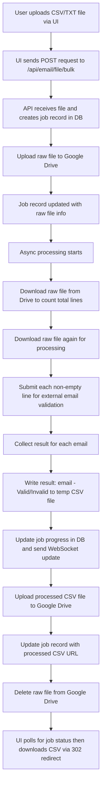

# Email Validation API Documentation

## Overview

The Email Validation API allows you to verify if an email address is valid by interfacing with an external validation service. The API makes an HTTP POST request using a proxy configuration and returns a JSON response that includes the email, a validity flag, a status code, and a descriptive message.

## Base URL

http://localhost:9000/api/email

## Endpoint

### POST `/validate`

**Description:**  
Validate an email address by sending a POST request with the email data. The API checks the email using an external service and returns the validation result.

### Request Headers

- **Content-Type:** `application/json`

### Request Body

The request payload should be a JSON object with the following field:

- **email (string):** The email address to validate.

**Example Request:**

```json
{
  "email": "example@example.com"
}
```

### Response

The API will return a JSON object with the following fields:

- **email (string):** The email address that was validated.
- **isValid (boolean):** A flag indicating whether the email is valid.
- **statusCode (number):** The status code of the validation process.
- **message (string):** A descriptive message providing additional information about the validation result.

**Example Response:**

```json
{
  "email": "example@example.com",
  "isValid": true,
  "statusCode": 250,
  "message": "Valid email"
}
```

**Detailed Response Examples:**

- **Valid Email:**
  ```json
  {
    "email": "valid@example.com",
    "isValid": true,
    "statusCode": 250,
    "message": "Valid email"
  }
  ```

- **User Not Found:**
  ```json
  {
    "email": "notfound@example.com",
    "isValid": false,
    "statusCode": 550,
    "message": "Not Available - User not found"
  }
  ```

- **Mailbox Full:**
  ```json
  {
    "email": "full@example.com",
    "isValid": false,
    "statusCode": 452,
    "message": "Mailbox Full"
  }
  ```

- **Rejected by Server:**
  ```json
  {
    "email": "rejected@example.com",
    "isValid": false,
    "statusCode": 554,
    "message": "Rejected by server"
  }
  ```

- **Unexpected Status:**
  ```json
  {
    "email": "unexpected@example.com",
    "isValid": false,
    "statusCode": -1,
    "message": "Unexpected response format"
  }
  ```

### Common Status Codes

- **250:** Valid email.
- **550:** Not Available – User not found.
- **452:** Mailbox full.
- **554:** Rejected by server.
- **-1:** Email not found in domain results, domain not found in results for email, unexpected response format, or error processing response.

## Front-End Implementation

To integrate the Email Validation API in your front-end application, follow these steps:

1. **Make an HTTP POST Request:**
   Use `fetch` or any HTTP client library (e.g., Axios) to send a POST request to the `/validate` endpoint with the email data.

2. **Handle the Response:**
   Process the JSON response to handle the validation result accordingly.

**Example using cURL:**

```sh
curl -X POST http://<your-server-domain>/api/email/validate \
  -H "Content-Type: application/json" \
  -d '{"email": "example@example.com"}'
```

**Example using Fetch:**

```javascript
const validateEmail = async (email) => {
  const response = await fetch('http://<your-server-domain>/api/email/validate', {
    method: 'POST',
    headers: {
      'Content-Type': 'application/json'
    },
    body: JSON.stringify({ email })
  });

  const data = await response.json();
  return data;
};

validateEmail('example@example.com')
  .then(data => {
    if (data.isValid) {
      console.log('Email is valid:', data.message);
    } else {
      console.log('Email is invalid:', data.message);
    }
  })
  .catch(error => {
    console.error('Error validating email:', error);
  });
```

**Example using Axios:**

```javascript
const axios = require('axios');

const validateEmail = async (email) => {
  try {
    const response = await axios.post('http://<your-server-domain>/api/email/validate', { email });
    const data = response.data;

    if (data.isValid) {
      console.log('Email is valid:', data.message);
    } else {
      console.log('Email is invalid:', data.message);
    }
  } catch (error) {
    console.error('Error validating email:', error);
  }
};

validateEmail('example@example.com');
```

## Bulk Email Validation API Documentation

### Overview

This API allows users to upload a CSV or TXT file containing email addresses for bulk processing. Once uploaded, the file is stored on Google Drive and processed asynchronously. The processing validates each email (by calling an external API using a proxy with retries) and writes the results to a new CSV file on Drive. WebSocket updates are sent as each email is processed. Finally, the raw file is deleted from Drive, and the processed file URL is stored in the job record.

### Endpoints

#### 1. POST `/api/email/file/bulk`

**Description:**  
Uploads a file containing email addresses to process them in bulk. The file is immediately uploaded to Google Drive and a job record is created. The API returns a jobId for tracking.

**Request Headers:**

- **Content-Type:** `multipart/form-data`

**Request Body:**

- **file (file):** A CSV or TXT file containing email addresses.

**Example cURL Request:**

```sh
curl -X POST http://<your-server-domain>/api/email/file/bulk \
  -F "file=@path/to/your/file.csv"
```

**Example Response:**

```json
{
  "jobId": "123e4567-e89b-12d3-a456-426614174000",
  "status": "IN_PROGRESS"
}
```

#### 2. GET `/api/email/file/status/{jobId}`

**Description:**  
Retrieves the current status of the bulk processing job by its jobId.

**Response:**

```json
{
  "jobId": "123e4567-e89b-12d3-a456-426614174000",
  "progress": 50,
  "status": "IN_PROGRESS",
  "message": "Processed 50 of 100 emails"
}
```

- **jobId:** The unique identifier of the bulk job.
- **progress:** Completion percentage (0–100).
- **status:** Current status (e.g., IN_PROGRESS, COMPLETED, FAILED).
- **message:** A descriptive message about the progress.

#### 3. GET `/api/email/file/download/{jobId}`

**Description:**  
If the bulk processing job is completed, this endpoint redirects (HTTP 302) to the processed CSV file's public URL on Google Drive.

**Response:**  
A 302 Redirect with the Location header pointing to the processed file URL.

### Processing Flow

Below is a Mermaid diagram illustrating the step-by-step flow for bulk processing:



### Additional Considerations

**Large File Handling:**  
The solution streams file data (using BufferedReader) to avoid loading the entire file into memory. Processed results are written directly to a temporary CSV file on disk (which is deleted after upload). In production, if files are extremely large (e.g., 10 million records), you may consider using Spring Batch for partitioned, fault-tolerant processing.

**Concurrency & Throttling:**  
The current design uses a fixed thread pool (e.g., 10 threads) to validate emails concurrently. Adjust THREAD_POOL_SIZE as needed based on your hardware and expected load.

**Error Handling & Retries:**  
Each email validation call uses a retry mechanism (up to 3 attempts) with proxy support to improve robustness.

**WebSocket Updates:**  
The system sends a WebSocket update for every email processed (or each completed task) so the UI always gets the latest progress.

**Google Drive Storage:**  
The raw file is stored on Google Drive at upload time, then processed CSV is uploaded after validation, and finally, the raw file is deleted to free up space.
